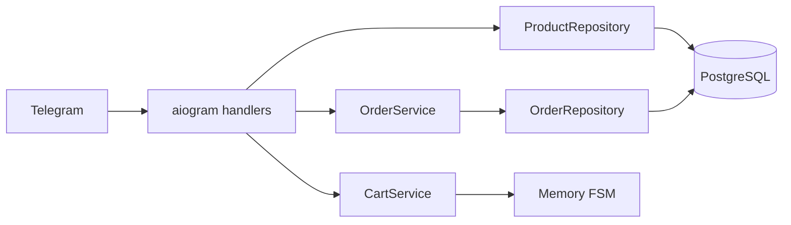
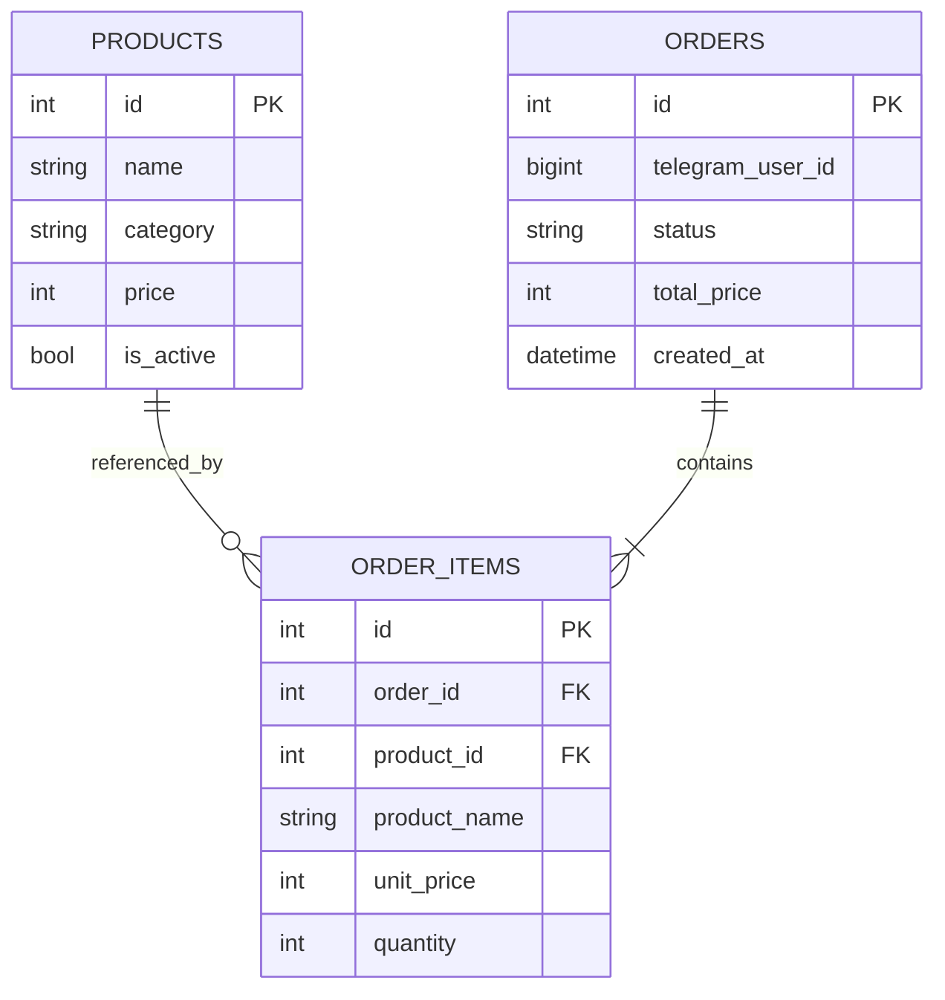

# PizzaForge


Демонстрационный Telegram-бот пиццерии для портфолио. Пользователь может открыть меню, собрать корзину и сохранить ненастоящий заказ. Бот не принимает оплату и не передаёт заказ ресторану.

## Возможности

- меню загружается из PostgreSQL;
- inline-навигация по категориям;
- корзина с изменением количества, подсчётом товаров и итоговой суммы;
- транзакционное сохранение демо-заказа;
- снимок названия и цены товара в истории заказа;
- асинхронная работа с БД;
- миграции и начальное заполнение каталога через Alembic;
- запуск приложения и PostgreSQL через Docker Compose;
- автоматические проверки в GitHub Actions.

## Стек

- Python 3.14
- aiogram 3
- PostgreSQL 17
- SQLAlchemy 2 + asyncpg
- Alembic
- Docker Compose

## Архитектура



Корзина является временным интерфейсным состоянием и хранится в FSM. Каталог и подтверждённые демо-заказы хранятся в PostgreSQL.

## Модель данных



`order_items` хранит снимок названия и цены. Поэтому ранее созданный заказ не изменится после обновления каталога.

## Запуск через Docker

1. Создайте Telegram-бота через [BotFather](https://t.me/BotFather).
2. Скопируйте пример настроек:

   ```bash
   cp .env.example .env
   ```

3. Заполните `BOT_TOKEN`, `TG_URL` и смените пароль БД.
4. Запустите проект:

   ```bash
   docker compose up --build -d
   ```

Compose дождётся готовности PostgreSQL, применит миграции и только затем запустит бота.

Проверка состояния:

```bash
docker compose ps
docker compose logs -f bot
```

Остановка:

```bash
docker compose down
```

Для удаления локальных данных PostgreSQL используйте `docker compose down -v`. Эта команда необратимо удаляет volume с демо-заказами.

## Локальная разработка

При запуске Python вне Docker укажите `DB_HOST=localhost` и `DB_PORT=5433` в локальном `.env`, затем выполните:

```bash
python -m venv .venv
source .venv/bin/activate
pip install -r requirements.txt
alembic upgrade head
python main.py
```

На Windows активация окружения выполняется командой `.venv\Scripts\activate`.

## Миграции

Создание новой миграции после изменения моделей:

```bash
alembic revision --autogenerate -m "describe change"
alembic upgrade head
```

## Тесты

```bash
python -m unittest discover -v
python -m compileall -q .
```

## Ограничения демо

- оплата и доставка отсутствуют;
- корзина очищается при перезапуске процесса;
- в БД сохраняются Telegram ID пользователя и состав демо-заказа;
- проект предназначен для демонстрации архитектуры, а не для работы реальной пиццерии.
