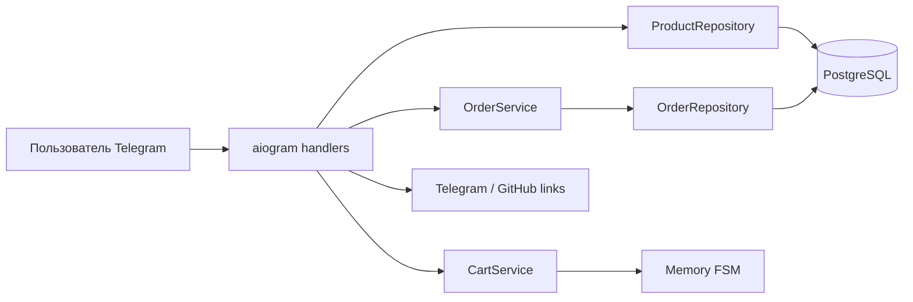
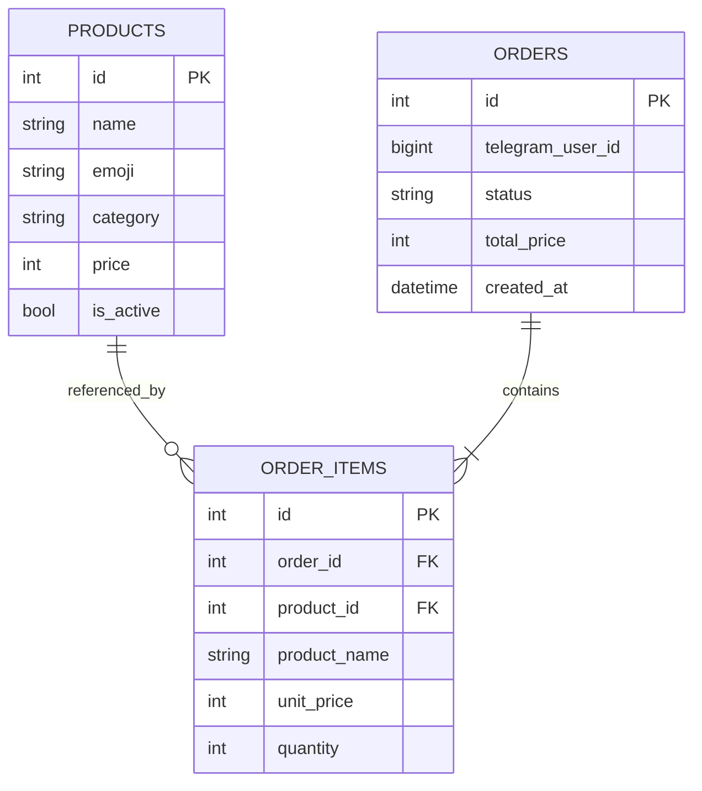

<p align="center">
  
</p>

<h1 align="center">PizzaForge</h1>

<p align="center">
  Рабочее демо Telegram-бота для пиццерии: от выбора блюда до сохранения заказа в PostgreSQL.
</p>

<p align="center">
  <a href="https://github.com/KezzGR/pizzaforge-telegram-bot/actions/workflows/ci.yml"></a>
  
  
  
  
  <a href="LICENSE"></a>
</p>

<p align="center">
  <a href="https://t.me/PizzaForgeBot"><strong>Открыть демо в Telegram →</strong></a>
</p>

## О проекте

PizzaForge — не статичный макет, а работающий Telegram-сценарий заказа еды. Пользователь выбирает категорию и блюда, управляет количеством в корзине, проверяет итог и сохраняет демо-заказ в базе данных.

Проект создан как портфолио-пример Telegram-решения для бизнеса. Он показывает не только интерфейс бота, но и серверную часть: PostgreSQL, миграции, транзакции, контейнеризацию, тесты и автоматический деплой.

> [!IMPORTANT]
> PizzaForge работает в демонстрационном режиме: оплата не выполняется, а заказ не передаётся ресторану.

## Пользовательский сценарий

1. Пользователь запускает бота командой `/start`.
2. Выбирает категорию и добавляет блюда одним нажатием.
3. Меняет количество, удаляет позиции или продолжает выбирать.
4. Проверяет состав и итоговую сумму.
5. Подтверждает демо-заказ, который транзакционно сохраняется в PostgreSQL.

Все внутренние экраны обновляются в одном сообщении. Чат не засоряется новыми сообщениями, а интерфейс ощущается как небольшое Telegram-приложение.

## Возможности

| Область | Реализация |
| --- | --- |
| Каталог | 15 позиций в четырёх категориях, данные загружаются из PostgreSQL |
| Корзина | Добавление, изменение количества, удаление позиции, очистка и подсчёт суммы |
| Мобильный UX | Пагинация по три позиции и отдельный компактный редактор товара |
| Навигация | Inline-кнопки, счётчик товаров и возврат на прежнюю страницу корзины |
| Безопасные действия | Подтверждение полной очистки и защита от оформления пустой корзины |
| Обратная связь | Toast-уведомления после добавления и изменения товаров |
| Демо-заказ | Проверка состава и транзакционное сохранение заказа с позициями |
| Контакт | Переход к разработчику с заранее подготовленным, но не отправленным сообщением |

## Инженерные решения

- асинхронный Telegram-бот на `aiogram`;
- разделение обработчиков, сервисов, репозиториев и моделей;
- SQLAlchemy 2 с асинхронным драйвером `asyncpg`;
- PostgreSQL как источник каталога и хранилище демо-заказов;
- Alembic для схемы БД и начального заполнения каталога;
- транзакционное создание заказа и его позиций;
- снимок названия и цены товара в истории заказа;
- изоляция Telegram-событий для последовательной обработки быстрых нажатий;
- Docker-контейнер приложения запускается от непривилегированного пользователя;
- healthcheck PostgreSQL и запуск бота только после успешных миграций;
- CI с PostgreSQL, миграциями, тестами и проверкой компиляции;
- автоматический деплой после успешного CI в ветке `master`.

## Стек

- Python 3.14
- aiogram 3.30
- PostgreSQL 17
- SQLAlchemy 2 + asyncpg
- Alembic
- Pydantic Settings
- Docker Compose
- GitHub Actions

## Архитектура



Корзина хранится в FSM и изолирована между пользователями. Каталог, подтверждённые демо-заказы и их состав хранятся в PostgreSQL.

### Модель данных



`order_items` хранит снимок названия и цены. Поэтому изменение или удаление товара из каталога не меняет ранее созданные заказы.

## Структура проекта

```text
.
├── db/                         # SQLAlchemy-модели, подключение и репозитории
├── migrations/                 # Alembic и начальные данные каталога
├── models/                     # Доменные Pydantic-модели
├── services/                   # Логика корзины и оформления заказа
├── tests/                      # Модульные и презентационные тесты
├── images/                     # Аватар и баннер PizzaForge
├── cached_messages.py          # Тексты экранов
├── cached_keyboards.py         # Inline-клавиатуры
├── callbacks.py                # Типизированные callback-данные
├── handlers.py                 # Telegram-обработчики
├── main.py                     # Точка входа
├── docker-compose.yml          # PostgreSQL, миграции и бот
└── Dockerfile                  # Образ приложения
```

## Быстрый запуск через Docker

### 1. Клонируйте репозиторий

```bash
git clone https://github.com/KezzGR/pizzaforge-telegram-bot.git
cd pizzaforge-telegram-bot
```

### 2. Подготовьте конфигурацию

Linux/macOS:

```bash
cp .env.example .env
```

Windows PowerShell:

```powershell
Copy-Item .env.example .env
```

Заполните как минимум:

```dotenv
BOT_TOKEN=токен_из_BotFather
TG_URL=https://t.me/ваш_username
GITHUB_URL=https://github.com/ваш_username/ваш_репозиторий
DB_PASSWORD=надёжный_пароль
```

Не добавляйте `.env` в Git — файл уже включён в `.gitignore`.

### 3. Запустите проект

```bash
docker compose up --build -d
```

Compose выполнит запуск в правильном порядке:

```text
PostgreSQL healthcheck → alembic upgrade head → bot
```

### 4. Проверьте состояние

```bash
docker compose ps
docker compose logs -f bot
```

Остановка без удаления данных:

```bash
docker compose down
```

> [!CAUTION]
> `docker compose down -v` удаляет PostgreSQL volume вместе с каталогом и сохранёнными демо-заказами.

## Локальная разработка без контейнера бота

Потребуется запущенный PostgreSQL и значения `DB_HOST=localhost`, `DB_PORT=5433` в локальном `.env`.

Создание окружения:

```bash
python -m venv .venv
```

Активация на Linux/macOS:

```bash
source .venv/bin/activate
```

Активация в Windows PowerShell:

```powershell
.\.venv\Scripts\Activate.ps1
```

Установка и запуск:

```bash
pip install -r requirements.txt
alembic upgrade head
python main.py
```

## Переменные окружения

| Переменная | Назначение | Значение по умолчанию |
| --- | --- | --- |
| `BOT_TOKEN` | Токен Telegram-бота | обязательна |
| `TG_URL` | Ссылка на разработчика с подготовленным сообщением | обязательна |
| `GITHUB_URL` | Ссылка на репозиторий из интерфейса бота | обязательна |
| `DB_HOST` | Адрес PostgreSQL | `localhost` в приложении, `db` в Compose |
| `DB_PORT` | Внутренний порт PostgreSQL | `5432` |
| `DB_EXPOSE_PORT` | Локальный порт PostgreSQL из Compose | `5433` |
| `DB_USER` | Пользователь PostgreSQL | обязательна |
| `DB_PASSWORD` | Пароль PostgreSQL | обязательна |
| `DB_NAME` | Название базы | обязательна |
| `DEBUG` | SQLAlchemy debug-логирование | `false` |
| `LOG_LEVEL` | Уровень логирования приложения | `INFO` |

## Миграции

Применить все миграции:

```bash
alembic upgrade head
```

Создать миграцию после изменения SQLAlchemy-моделей:

```bash
alembic revision --autogenerate -m "describe change"
```

Откатить последнюю миграцию:

```bash
alembic downgrade -1
```

## Тесты

```bash
python -m unittest discover -v
python -m compileall -q .
```

Текущий набор проверяет сервис корзины, форматирование экранов, callback-кнопки, конфигурацию и структуру моделей БД.

## CI/CD

Workflow `.github/workflows/ci.yml` запускается для `push` и `pull_request`:

1. поднимает PostgreSQL 17;
2. устанавливает зависимости;
3. применяет миграции Alembic;
4. запускает тесты;
5. проверяет компиляцию Python-файлов.

После успешной проверки push в `master` запускает deploy-job. Он подключается к серверу по SSH и вызывает заранее настроенный серверный скрипт `/usr/local/sbin/deploy-pizzaforge`.

Для deploy-job используются GitHub Secrets:

- `DEPLOY_SSH_KEY`;
- `DEPLOY_KNOWN_HOSTS`;
- `DEPLOY_HOST`;
- `DEPLOY_USER`.

## Ограничения демо

- оплаты и интеграции с доставкой нет;
- заказ сохраняется в БД, но не передаётся ресторану;
- корзина хранится в памяти и очищается при перезапуске процесса;
- административная панель отсутствует;
- в заказе сохраняется Telegram ID пользователя;
- резервное копирование и мониторинг сервера не входят в этот репозиторий.

Для реального бизнеса эту основу можно расширить оплатой, доставкой, уведомлениями сотрудников, административной панелью и аналитикой.

## Лицензия

Проект распространяется по лицензии [MIT](LICENSE). Код можно использовать, изменять и распространять с сохранением текста лицензии и уведомления об авторских правах.

## Автор

Проект разработан как практический пример production-minded Telegram-разработки.

- GitHub: [KezzGR](https://github.com/KezzGR)
- Демо: [@PizzaForgeBot](https://t.me/PizzaForgeBot)
- Репозиторий: [pizzaforge-telegram-bot](https://github.com/KezzGR/pizzaforge-telegram-bot)
